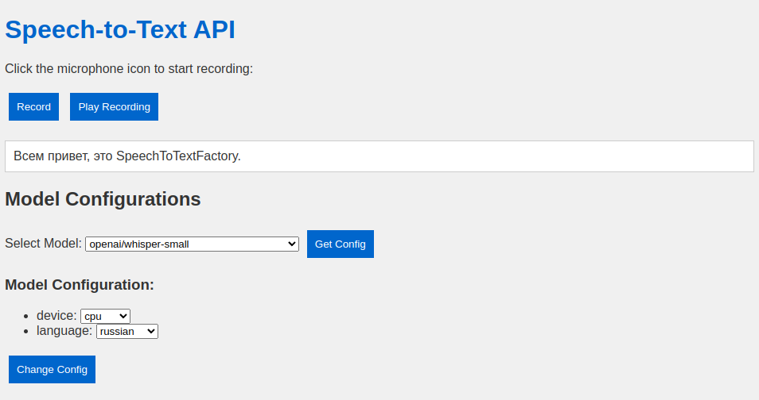

# Speech2text Factory

    


 

## What is it?
Speech2Text Factory is a modular project that can be integrated with other projects requiring a speech-to-text model. The server-side implementation is built on FastAPI. If needed, the project can be used independently by accessing the root page of the deployed project.




# Table of contents
```bash
speech2text_factory/
│
├── docker-compose.yml              # Docker Compose configuration file
├── dockerfile                      # Dockerfile for creating Docker container
├── docs/                           # Directory for documentation and design files
│   ├── index.html                  # Main HTML documentation file
│   ├── src/                        # Directory for source files used in documentation
│   └── style.css                   # CSS stylesheet for documentation styling
│
├── LICENSE                         # License file
├── Makefile                        # Makefile for project automation
├── README.md                       # Project description and instructions
├── requirements.txt                # Python dependencies list for pip
└── src/                            # Source code directory
    ├── ai_models/                  # Directory for AI model scripts
    │   ├── speech2text.py          # Speech-to-text model script
    │   ├── speech2text_interface.py   # Interface script for speech-to-text model
    │   └── stt/                    # Directory for specific speech-to-text model
    │       ├── buffer/             # Directory for buffer related scripts
    │       ├── model.py            # Script for speech-to-text model
    │       └── weights/            # Directory for model weights
    ├── api/                        # Directory for API scripts
    │   ├── app/                    # Directory for application specific API scripts
    │   │   ├── crud.py             # Script for CRUD operations
    │   │   ├── endpoint.py         # Endpoint script
    │   │   ├── middleware.py       # Middleware script
    │   │   ├── models.py           # Models script
    │   ├── main.py                 # Main API script
    ├── data/                       # Directory for data files
    │   ├── audio.mp3               # Audio file
    │   └── test.wav                # Test audio file
    ├── main.py                     # Main script
    └── utils/                      # Directory for utility scripts
        ├── features_extractor.py   # Feature extractor script
```


# Installation
To install all dependencies and run locally 

```python
make build
cd src
python3 main.py
```


Or you can run a docker container
```bash
docker run -p your_port:8000 dimkablin/speech2text_factory
```

Replace ```your_port``` with the port number on which you intend to run the container.


# API Endpoints

| Endpoint                  | Description                                      |
|---------------------------|--------------------------------------------------|
| `/`                       | Return a greeting site.                          |
| `/get-model-names/`       | Return a list of model names.                    |
| `/get-current-model/`     | Return the name of the current model.            |
| `/speech-to-text/`        | Predict function.                                |
| `/get-model-config/`      | Return the config of the model.                  |
| `/change-model/`          | Change the model.                                |

# Contact

Feel free to open an issue or submit a pull request.
